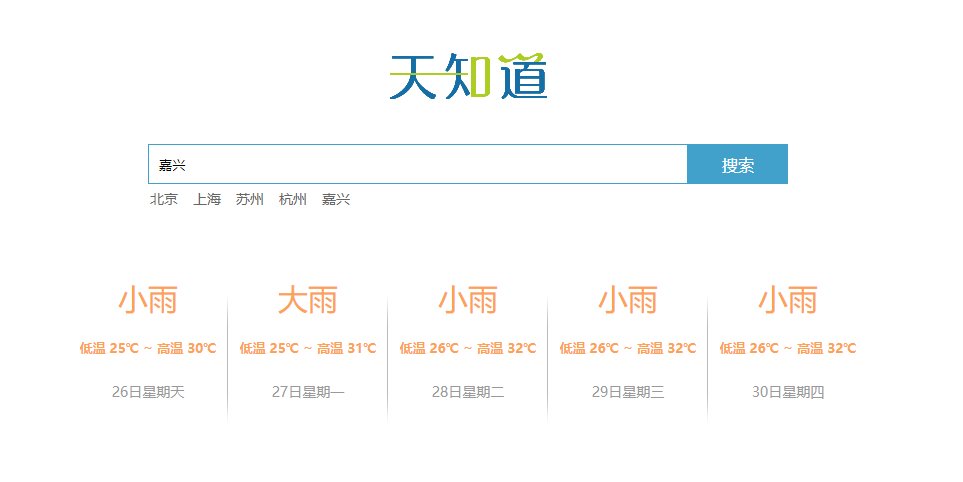

# 入门vue课程笔记
[B站的课程链接](https://www.bilibili.com/video/BV12J411m7MG)  

## demo-queryWeather 天气查询

按照课程重新写了`demo.html`中js中的内容  

**最终效果**  


### 总结
- vue和axios的引入  
引入线上版本  
```
<script src="https://cdn.jsdelivr.net/npm/vue/dist/vue.js"></script>
<!-- 官网提供的 axios 在线地址 -->
<script src="https://unpkg.com/axios/dist/axios.min.js"></script>
<script src="https://cdn.staticfile.org/axios/0.18.0/axios.min.js"></script>
```
官网版本访问不流畅，可以使用cdn加速的版本  
也可以用npm下载到本地，再引入本地的js  

- vue的基本使用
```
<!-- 注意Vue首字母大写 -->
new Vue({
    <!-- el为挂载 支持css选择器 -->
      el: "#app",
      data: {
        city: null,
        forcastList: [],
        hotCities: ["北京", "上海", "苏州", "杭州","嘉兴"]
      },
      methods: {
        queryWeather() {
            <!-- function content -->
          };
          
        },
        clickChangeCity(param){
          <!-- function content -->
        }
      }
    });
```

- 用v-for进行列表渲染
```
<ul class="weather_list">
        <!-- forcastList为data重的数据 -->
      <li v-for="item in forcastList">
      <!-- 用{{使用数据}} -->
        <div class="info_type"><span class="iconfont">{{item.type}}</span></div>
        <div class="info_temp">
          <b>{{item.low}}</b>
          ~
          <b>{{item.high}}</b>
        </div>
        <div class="info_date"><span>{{item.date}}</span></div>
      </li>
    </ul>
```

- 用v-model对input和data数据的双向绑定
- @keyup.enter 回车键触发
```
<input type="text" class="input_txt" placeholder="请输入查询的天气" v-model="city" @keyup.enter="queryWeather()" />
```
- @click 鼠标点击触发
```
<button class="input_sub" @click="queryWeather()">
```

- 由于this的变化无法拿到其中的数据 在外部用var that = this;储存
```
queryWeather() {
          var that = this;
          if (this.city!==null){
            axios.get("http://wthrcdn.etouch.cn/weather_mini?city=" + this.city)
            .then((res) => {
              that.forcastList = res.data.data.forecast;
            })
            .catch(err => {
              console.log(err)
              window.alert(`没有查询到城市："${this.city}"的天气`)
            });
          }else{
            window.alert("请输入查询天气的城市")
          };
          
        }
```
